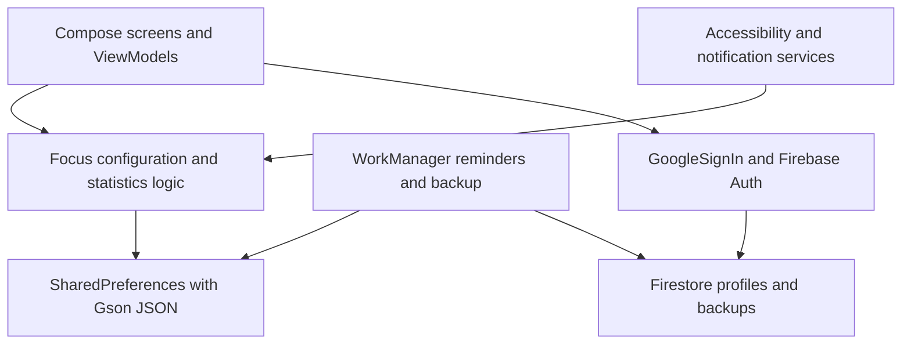

# MindVault Architecture & Design

MindVault is a local-first Android application using Jetpack Compose, Kotlin Coroutines/Flow, SharedPreferences, Firebase Auth, and Firestore. Room dependencies remain in the build but are unused by current persistence. `FocusDataStore` is a SharedPreferences wrapper, not Jetpack DataStore.

## Architectural Layers

- **Presentation:** Compose activities and ViewModels expose UI state and handle events.
- **Local data:** Preferences hold configuration, profiles, session history, and statistics; structured values use Gson JSON. There is no Room session database or cross-file SharedPreferences transaction.
- **Background work:** Accessibility/notification services implement focus policy; WorkManager schedules reminders and backups. Android lifecycle, permissions, and device-specific restrictions affect operation.
- **Authentication:** `AuthManager` uses the Google Play services `GoogleSignIn` client and exchanges credentials with Firebase Auth, not Credential Manager.
- **Cloud data:** Profile and backup operations use Firestore. A `backups/{userId}` path is not itself authorization; deployed rules and their account-isolation behavior remain unverified.

## Backup Format and Compatibility

Preference backup sections (`user_prefs`, `focus_prefs`, `stats_prefs`) are JSON strings. New writes use the **v1 typed format**: a `version: 1` envelope with `entries`, each containing a `type` and `value`. Tags distinguish strings, booleans, integers, longs, floats, and string sets.

The new reader also accepts the old unversioned format, using known preference keys to recover numeric types. Unknown legacy numeric keys and malformed or unsupported data are rejected rather than guessed. **New v1 backups are not backward compatible with older app readers.** Upgrade all devices sharing backups before writing the new format; retain a separate known-good legacy backup if an app downgrade is needed.

All required sections are decoded before restore writes begin, but SharedPreferences cannot provide an atomic transaction across multiple preference files. Interrupted writes remain a recovery consideration.

## Security and Operational Boundaries

- Focus behavior runs on-device, but cloud sign-in, profiles, and backups communicate with Firebase. This is not a claim that every app path is offline or free of sensitive logging.
- Accessibility and notification access are sensitive privileges. Review their use and user consent; the app is not a tamper-proof device-management boundary.
- Blocking and call-handling policy are intentionally unchanged by this audit work. Associated availability and call-access risks remain; sessions are not guaranteed uninterruptible, and this work does not establish guaranteed emergency access.
- Backups are **not end-to-end encrypted by MindVault**. Provider transport/storage protections do not prevent authorized backend access or replace correctly deployed Firestore rules.
- App password protection is an app-level gate, not encryption of all locally stored data or a substitute for Android device security.

## Build and Distribution

Use a compatible **JDK 17+** as the Gradle runtime and install **Android SDK 36** (compile/target; minimum device API 28). Java/Kotlin bytecode targets remain 11; this does not make JDK 11 a supported Gradle runtime for this build.

Release signing is opt-in through explicit environment variables; without them, release assembly is unsigned. CI uses dummy Firebase configuration and performs build-only unit tests, lint, and release assembly, not live authentication or verification of deployed Firestore rules. See [README.md](README.md) for signing-identity continuity and setup, and [SECURITY.md](SECURITY.md) for private reporting.
