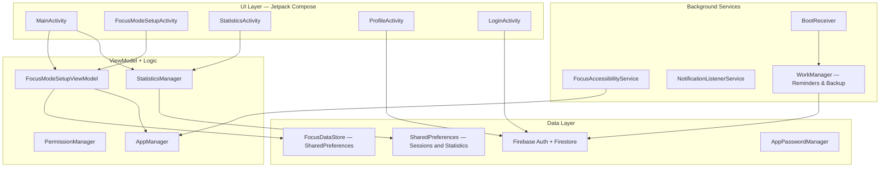

<p align="center">
  <h1 align="center">🧠 MindVault</h1>
  <p align="center">
    A native Android study companion with focus sessions, app blocking, and productivity analytics.
  </p>
  <p align="center">
    <a href="https://welcomelegend-git.github.io/mindvault/"></a>
    <a href="https://github.com/WelcomeLegend-Git/mindvault/releases/latest"></a>
  </p>
</p>

<p align="center">
  <a href="https://www.bestpractices.dev/projects/14077"></a>
  
  
  
  

  
  
</p>

---

## Overview

MindVault is an Android app designed to help students focus during study sessions. It uses lock screens, overlays, and accessibility-based app blocking alongside study analytics, notifications, and Firebase cloud backup. Behavior depends on permissions, Android lifecycle, and device restrictions; sessions are not guaranteed uninterruptible.

Focus blocking and call-handling policy are intentionally unchanged by this audit work. Related availability and call-access risks remain; this work does not establish guaranteed emergency access or tamper resistance.

### Key Features

| Feature | Description |
|---------|-------------|
| **Focus Mode** | Full-screen lock with foreground service, wake lock, and overlays, subject to Android and permission limitations |
| **App Blocking** | Accessibility service monitors and blocks distracting apps during active sessions |
| **Smart Scheduling** | Configurable study/sleep windows with automatic session availability detection |
| **Productivity Analytics** | Pie charts, weekly screen-time breakdowns, streak tracking, and session history |
| **Achievement System** | Gamified milestones to reward consistent study habits |
| **Cloud Sync** | Firebase Auth + Firestore for cross-device backup and profile management |
| **Daily Motivation** | Scheduled motivational notifications via WorkManager |
| **Security** | App-level password protection and developer settings guard |

---

## Architecture



---

## Tech Stack

| Layer | Technology |
|-------|-----------|
| **Language** | Kotlin |
| **UI** | Jetpack Compose, Material Design 3 |
| **Architecture** | MVVM with ViewModel + StateFlow |
| **Local Storage** | SharedPreferences with Gson JSON; Room dependencies exist but are unused |
| **Cloud** | Firebase Auth, Firestore (sync & backup) |
| **Background** | Foreground Service, AccessibilityService, WorkManager |
| **Auth** | Google Play services `GoogleSignIn` + Firebase Auth (not Credential Manager) |
| **Image Loading** | Coil |
| **Serialization** | Gson |
| **Build** | Gradle KTS with version catalogs |

---

## Project Structure

```
mindvault/
├── app/src/main/java/com/example/mindvault/
│   ├── MainActivity.kt                # Main entry, home screen, navigation
│   ├── MindVaultApplication.kt        # Application class, dependency setup
│   ├── AppBlockedActivity.kt          # Overlay shown when blocked app is opened
│   ├── BootReceiver.kt                # Re-schedule workers on device restart
│   │
│   ├── data/
│   │   ├── FocusDataStore.kt          # SharedPreferences configuration wrapper
│   │   ├── FocusSession.kt            # Session models and preference persistence
│   │   ├── StatisticsManager.kt       # Aggregation logic for analytics
│   │   ├── AuthManager.kt             # Firebase Auth wrapper
│   │   ├── UserManager.kt             # Firestore user profile CRUD
│   │   ├── AppPasswordManager.kt      # App-level password verification
│   │   └── BackupSyncWorker.kt        # Periodic Firestore sync via WorkManager
│   │
│   ├── model/
│   │   └── FocusModels.kt             # Domain models and enums
│   │
│   ├── notifications/
│   │   ├── NotificationHelper.kt      # Channel setup + notification builder
│   │   ├── FocusReminderScheduler.kt  # Schedule daily study reminders
│   │   ├── FocusReminderWorker.kt     # WorkManager worker for reminders
│   │   ├── MotivationScheduler.kt     # Schedule motivational quotes
│   │   └── DailyMotivationWorker.kt   # WorkManager worker for motivation
│   │
│   ├── services/
│   │   ├── FocusAccessibilityService.kt      # Monitors and blocks apps
│   │   └── FocusNotificationListenerService.kt # Manages notification suppression
│   │
│   ├── ui/
│   │   ├── FocusModeSetupActivity.kt  # Session configuration screen
│   │   ├── FocusModeSetupViewModel.kt # ViewModel for focus setup
│   │   ├── LockScreenActivity.kt      # Full-screen lock during sessions
│   │   ├── StatisticsActivity.kt      # Analytics dashboard
│   │   ├── ProfileActivity.kt         # User profile management
│   │   ├── LoginActivity.kt           # Firebase auth flow
│   │   ├── AchievementsActivity.kt    # Gamified milestones
│   │   ├── SecurityActivity.kt        # App lock settings
│   │   ├── PieChartComponents.kt      # Custom Compose chart components
│   │   ├── PremiumAnalyticsComponents.kt # Analytics card composables
│   │   ├── WeeklyComponents.kt        # Weekly breakdown UI
│   │   ├── WeeklyScreenTimeChart.kt   # Screen time visualization
│   │   └── theme/                     # Material 3 color, type, theme
│   │
│   └── utils/
│       ├── AppManager.kt             # App list and blocking logic
│       ├── OverlayBlocker.kt         # System overlay protection
│       ├── PermissionManager.kt      # Runtime permission handling
│       └── UsageStatsHelper.kt       # Android UsageStats API wrapper
│
├── app/build.gradle.kts               # App-level build config
├── build.gradle.kts                   # Root plugin configuration
├── settings.gradle.kts                # Project settings
└── gradle/                            # Gradle wrapper + version catalog
```

---

## Getting Started

### Prerequisites

- **Android Studio** with support for Android Gradle Plugin 8.12.1
- **JDK 17+** compatible with Gradle 8.13; CI uses JDK 17
- **Android SDK** 36 (compile/target), Build Tools 35.0.0 / API 28 minimum device
- A **Firebase** project with Auth and Firestore enabled

Set `JAVA_HOME` to your JDK installation or select it as Android Studio's Gradle JDK. Do not commit a machine-specific `org.gradle.java.home`; any such override belongs in your user-level `~/.gradle/gradle.properties`. Java/Kotlin bytecode still targets 11, which is distinct from the JDK 17+ Gradle runtime requirement.

### 1. Clone

```bash
git clone https://github.com/WelcomeLegend-Git/mindvault.git
cd mindvault
```

### 2. Firebase Setup

1. Create a Firebase project at [console.firebase.google.com](https://console.firebase.google.com)
2. Add an Android app with package name `com.example.mindvault`
3. Download `google-services.json` and place it in `app/`. This real configuration is ignored and must not be tracked or included in reports.
4. Enable **Authentication** (Google Sign-In) and **Firestore Database**. Register the signing certificate fingerprints for each intended build identity.
5. Review and test the deployed Firestore rules for authenticated, per-user access. **Deployed rules are unverified by this audit**; `backups/{userId}` paths alone do not enforce authorization.

### 3. Build & Run

```bash
./gradlew assembleDebug
```

On Windows, use `gradlew.bat` instead of `./gradlew`. Or open the project in Android Studio and click **Run**.

### 4. Release Signing

`assembleRelease` produces an **unsigned** release APK when no signing credentials are supplied. It never falls back to the debug key. To sign a release, supply all four environment variables in a trusted build environment:

| Variable | Meaning |
|----------|---------|
| `MINDVAULT_RELEASE_STORE_FILE` | Keystore path (prefer absolute; relative paths resolve from `app/`) |
| `MINDVAULT_RELEASE_STORE_PASSWORD` | Keystore password |
| `MINDVAULT_RELEASE_KEY_ALIAS` | Signing key alias |
| `MINDVAULT_RELEASE_KEY_PASSWORD` | Key password |

Partial credentials fail configuration rather than silently generating a different artifact. These settings are read from the environment only; the build does not load `.env` or `keystore.properties`. Keep keystores and passwords out of source control, logs, and reports. Keystore files, `keystore.properties`, and `.env` files are ignored. Securely retain the release key and credentials for future updates.

**Existing installations:** earlier release configuration used the debug signing key. An in-place Android update requires the same signing identity (or a properly supported signing-key rotation), not merely the same package name. A newly generated release key cannot transparently update those APKs. Verify the certificate of previously distributed APKs and plan migration before distributing a differently signed build. Uninstall/reinstall can erase local data; preserve a usable backup first. Do not reintroduce automatic debug signing to hide this incompatibility.

### CI and Local Checks

The workflow creates an ignored, dummy `app/google-services.json` with deliberately invalid credentials and a dummy web client ID. It is for **build-only checks**, not live authentication or Firestore access; do not distribute or use the resulting APK with real accounts. CI does not receive Firebase or release-signing secrets and does not upload builds to Firebase App Distribution.

The configured checks are:

```bash
./gradlew :app:testDebugUnitTest :app:lintDebug :app:assembleRelease --continue --no-daemon
```

CI uses read-only repository permissions, a 30-minute timeout, and uploads available test/lint reports even when checks fail. These checks do not verify deployed Firestore rules, live Google sign-in, or device-specific blocking/call behavior.

## Backup and Security Boundaries

- Local storage uses **SharedPreferences**, including Gson JSON for structured values. `FocusDataStore` is not Jetpack DataStore; Room dependencies are present but unused.
- New preference backups use a **typed v1 format** with `version` and `entries`, preserving preference types. The new reader also reads the old unversioned format using known key types. **New backups are not backward compatible with older app readers.** Upgrade devices sharing backups together; keep a separate legacy backup if downgrading may be necessary.
- Backups are **not end-to-end encrypted by MindVault**. Firebase transport/storage protections are not a substitute for correct access rules, and deployed rules remain unverified.
- App password protection is an app-level gate, not encryption of all app data. Accessibility, notification suppression, and call-handling behavior require separate device testing and risk review.

See [ARCHITECTURE.md](ARCHITECTURE.md) and [SECURITY.md](SECURITY.md) for boundaries and private vulnerability reporting.

---

## Permissions

| Permission | Purpose |
|------------|---------|
| `SYSTEM_ALERT_WINDOW` | Overlay to block apps during focus sessions |
| `FOREGROUND_SERVICE` | Persistent focus session timer |
| `WAKE_LOCK` | Prevent device sleep during sessions |
| `ACCESSIBILITY_SERVICE` | Monitor and intercept app launches |
| `NOTIFICATION_LISTENER` | Suppress distracting notifications |
| `USAGE_STATS` | Screen time analytics |
| `RECEIVE_BOOT_COMPLETED` | Reschedule workers after restart |

---

## License

This project is licensed under the [MIT License](LICENSE).
