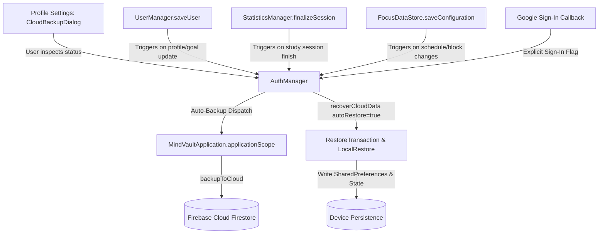

# Cloud Backup & Continuous Auto-Sync Specification

## Feature Overview & Purpose
The Cloud Backup & Continuous Auto-Sync feature in MindVault guarantees that students and users never lose their study statistics, focus configurations, weekly targets, streaks, and achievements across app updates, device migrations, or re-installations.

Prior implementations required users to manually navigate to an unstyled recovery card and execute manual backups. In v3.4.2, the system operates completely seamlessly:
1. **Instant Cloud Restore on Login**: Upon signing into a Google account, existing cloud data in Firestore is immediately detected and restored onto the device without requiring manual dialog prompts.
2. **Continuous Auto-Backup on Changes**: Any state change (completing/canceling a focus session, modifying weekly study goals, updating user profiles, or re-configuring blocked apps/schedules) immediately dispatches an asynchronous background backup to Cloud Firestore.
3. **Settings-Integrated UI**: The recovery UI is moved out of the main profile view into the "Settings" section as a sleek, native dark-purple card option (`ProfileOptionItem`) launching a custom glassmorphic `CloudBackupDialog`.

---

## Architecture & Key Components

### 1. `AuthManager.kt`
- Orchestrates Google authentication, cloud session state machines, and Firestore synchronizations.
- `autoBackupOnChange()`: Inspects the active Firebase user and authenticated session. If valid, launches `backupToCloud(session.uid)` asynchronously on the application scope, automatically queuing WorkManager retries (`enqueueBackupRetry()`) if network errors occur.
- `recoverCloudData(..., autoRestore = true)`: Automatically executes snapshot decode and local commit without requiring user manual confirmation when triggered by an explicit sign-in flow.

### 2. Mutation Integration Sites
- **`UserManager.kt` (`saveUser`)**: Automatically triggers `AuthManager.autoBackupOnChange()` whenever user attributes, weekly goals (e.g. 1200 mins), or preferences are saved.
- **`StatisticsManager.kt` (`finalizeSession`, `saveAchievements`)**: Automatically triggers `AuthManager.autoBackupOnChange()` when a focus session concludes (updating streaks, total focus minutes, and daily charts) or when achievements are unlocked.
- **`FocusDataStore.kt` (`saveConfiguration`)**: Automatically triggers `AuthManager.autoBackupOnChange()` whenever blocked apps, strict mode rules, or schedule windows are updated.

### 3. UI Layer (`CloudRecoveryCard.kt` & `ProfileActivity.kt`)
- `ProfileActivity.kt`: Integrates a `ProfileOptionItem` under `SettingsSection` displaying live sync status indicators ("Auto-sync active • Data protected", "Syncing changes to cloud…", or "Sync attention needed").
- `CloudBackupDialog.kt`: Formatted with MindVault's signature glassmorphic theme (background `#1E1B2E`, purple accent `#8B5CF6`, rounded corners `24.dp`, subtle glow), providing status inspection, manual sync triggers, and data safety warnings.

---

## Invariants & Constraints
1. **Ownership Invariant**: Cloud backups are keyed by the user's authenticated Google UID (`users/{uid}/backups/latest`). Backups owned by another account can never overwrite local data unless authenticated as that user.
2. **Idle Restore Enforcement (`requireIdleRestore`)**: Cloud restore is strictly blocked if an active focus session is running or an active focus schedule is currently enabled. Restores can never be used to bypass active lock sessions.
3. **Data Integrity & Non-Destructive Auto-Sync**: Regular background auto-sync writes local state to the cloud. Local data is never overwritten during normal startup or routine background syncs; automatic restore occurs exclusively during explicit sign-in initialization on clean/new installs.
4. **Offline Resilience**: When auto-backup encounters connectivity dropouts, WorkManager enqueues an expedited retry with network-connectivity constraints (`mindvault_backup_retry_${uid}`).

---

## Living Changelog
- **v3.4.0 (Build 11)**: Initial architecture hardening; partitioned Firestore security rules, added provenance metadata and `PreferencesBackup` encoding.
- **v3.4.1 (Build 12)**: Resolved Firestore path regression (`users/{uid}/backups/latest`); added legacy provenance auto-claim; preserved local statistics across fresh authentications.
- **v3.4.2 (Build 13)**:
  - Added seamless background auto-sync triggered across all state mutations (`UserManager`, `StatisticsManager`, `FocusDataStore`).
  - Added instant automatic restore of cloud data upon Google sign-in.
  - Redesigned Cloud Backup & Sync UI into a polished glassmorphic `CloudBackupDialog` located in the Profile Settings section.
